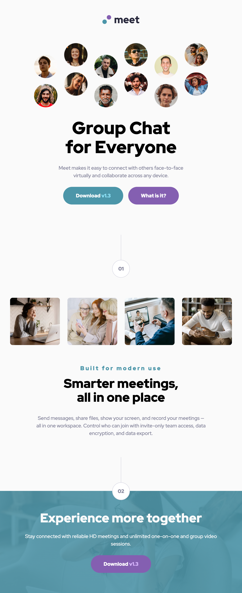

# Frontend Mentor - Meet landing page solution

This is a solution to the [Meet landing page challenge on Frontend Mentor](https://www.frontendmentor.io/challenges/meet-landing-page-rbTDS6OUR). Frontend Mentor challenges help you improve your coding skills by building realistic projects. 

## Table of contents

- [Overview](#overview)
  - [The challenge](#the-challenge)
  - [Screenshot](#screenshot)
  - [Links](#links)
- [My process](#my-process)
  - [Built with](#built-with)
  - [What I learned](#what-i-learned)
  - [Continued development](#continued-development)
  - [Useful resources](#useful-resources)
- [Author](#author)
## Overview

### The challenge

Users should be able to:

- View the optimal layout depending on their device's screen size
- See hover states for interactive elements

### Screenshot

<table align="center">
  <tr>
    <td></td>
    <td></td>
    <td></td>
  </tr>
  <tr align="center">
    <td>Desktop View</td>
    <td>Tablet View</td>
    <td>Mobile View</td>
  </tr>
</table>

### Links

- Solution URL: [Link](https://github.com/a-d14/meet-landing-page-frontend-mentor)
- Live Site URL: [Link](https://a-d14.github.io/meet-landing-page-frontend-mentor)

## My process

### Built with

- Semantic HTML5 markup
- SASS
- CSS custom properties
- Flexbox
- CSS Grid
- Mobile-first workflow

### What I learned

This was my first project using SASS. I applied a variety of concepts that were new to me while building this project.

- This was my first project using the 7-1 architecture which makes the CSS code more readable and maintable.
- I removed a lot of redundancy in my CSS using mixins, a SASS feature.
- I automated the conversion of px to rem using a function and "sass:math" package.

### Continued development

I plan to keep getting better at utilizing SASS for my projects.

### Useful resources

- [Coder Coder SASS Course](https://www.youtube.com/watch?v=jfMHA8SqUL4) - The best free resource for learning SASS on the internet.
- [SASS Guidelines](https://sass-guidelin.es/) - The best reference for SASS on the internet.

## Author
- Frontend Mentor - [@a-d14](https://www.frontendmentor.io/profile/a-d14)
